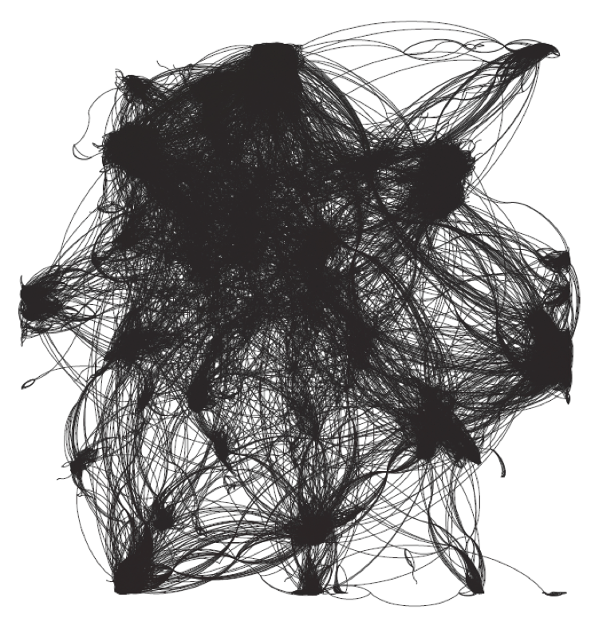
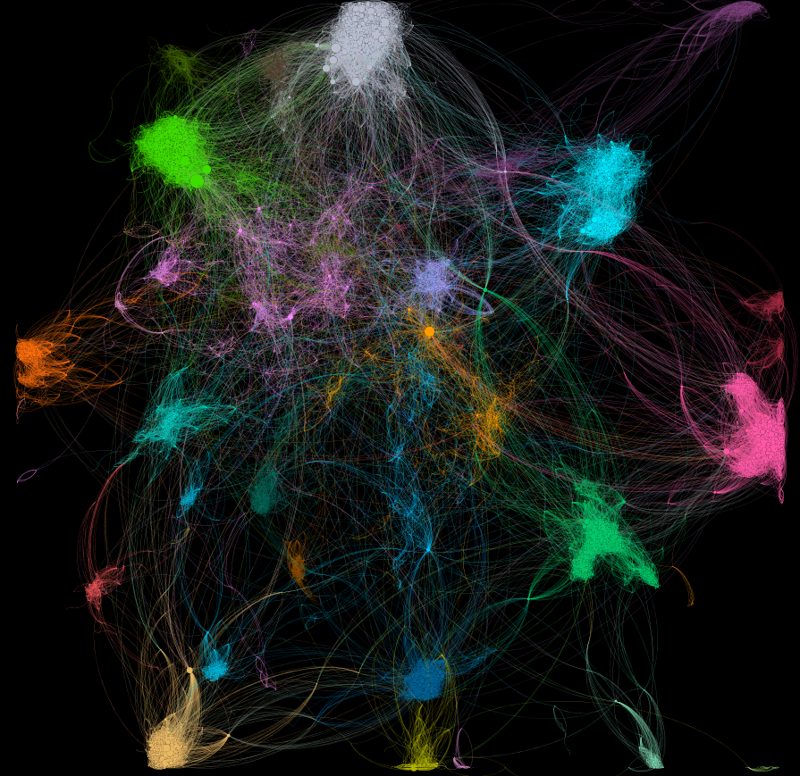
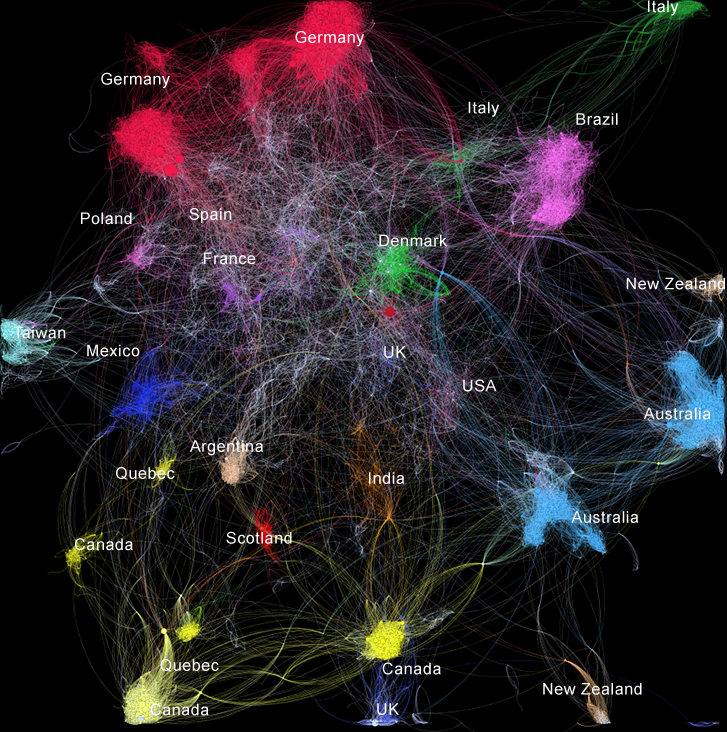
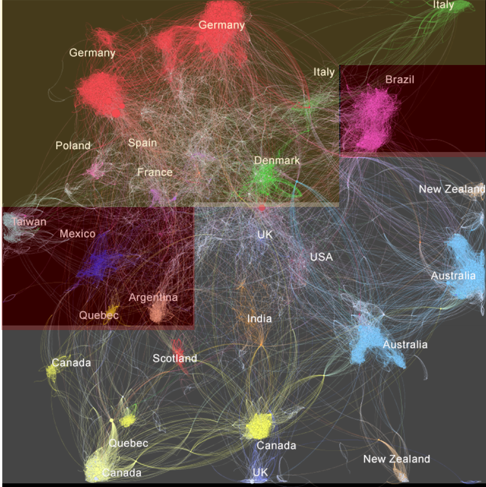

<style>
body, h1, h2, h3, h4 {
    font-family: "Bookman", serif;
    color: #313163
}
h1.title {
  text-align: center;
}

body {
    color: #333333;
    font-size: 14px;
}

pre {
    font-size: 14px;
}
</style>

---

```{r setup, include=FALSE}
knitr::opts_chunk$set(echo = F, warning = F, error = F)
```


```{r, include = F}
# Loading the libraries
library('knitr')
library('igraph')
library('sna')
library('centiserve')
library('CINNA')
library('expm')
library('data.table')
library('igraphdata')
library("tidyverse")
library('png') 
```
  
# The Data  

The dataset represents Facebook pages of politicians from different countries in November, 2017. Only verified Facebook pages were included. Nodes represent the pages and edges are mutual likes amongst them, thus the graph is undirected. In a more general sense, the data can be interpreted as political alliances that are demonstrated publicly. The goal of our analysis is to see whether those connections allign with the actual geopolitical situation in the world and to try to define clusters within their political network.  
Before we dive into the graph analysis let's have a look into common descriptive statistics in order to get the first glimpse of the data that we're about to analyse.


```{r}
# Loading the data

politicians_edges <- as.data.frame(fread("data/politician_edges.csv"), 
                                   directed=F)
politicians_ids <-as.data.frame(fread("data/politician_ids.csv"),
                                directed=F)
politicians_graph <- graph.data.frame(d = politicians_edges,vertices = politicians_ids)
```

# Take a Look at the Graph and its main statistics:

```{r, echo=FALSE, out.width = '60%', fig.align="center"}

```
```{r, fig.align="center"}
degree_politician <- igraph::degree(politicians_graph, mode="all")
degree_politician_distribution <- degree_distribution(politicians_graph, mode = "all")

# Plotting degree distribution
ggplot(data.frame(degree_politician), aes(x = degree_politician)) +
  geom_histogram(binwidth = 1, aes(y = ..count..), fill = "#313163") + theme_classic() +
        theme(plot.title = element_text(hjust = 0.5, colour = "#313163", size = 16), 
              axis.title.x = element_text(colour = "#313163"), 
              axis.title.y = element_text(colour = "#313163")) + xlab("Degree") +     ylab("Count") + labs(title = "Degree distribution" )

```


- **Mean degree: `r round(mean(degree_politician), 2)`**  

Mean degree shows the average number of connections per node, meaning that in this particular case every politician liked 14 other politician's FB pages.
Looking at the distribution of the degrees we can notice that about 10% of politicians are not connected to anybody, whilst there is a long tail of "outliers" - people who are connected with a lot of others.

- **Standard deviation of the degree: `r round(sd(degree_politician), 2)`**  

The standard deviation of the degree is higher than the mean degree emphasising that politicians' behaviour on FB differs significantly: some don't express their alliances at all whereas others actively publicly support others.

- **The average path length: `r round(average.path.length(politicians_graph, directed=F),2)`** 

The avarage path length represents the average shortest distance that politicians have to take in order to reach colleagues. The number is rather low which indicates that the nodes in the network are well connected, which makes sense since every politician must have a lot of connections.

- **Diameter: `r round(diameter(politicians_graph),2)`**  

Diameter represents the shortest path between the furthest nodes in the network. We would expect it to be relatively high since there are various politicians throughout the graph with low numbers of connections, and considering the large geographical span of the data it makes sense for it to take many edges to reach from one end of the network to the other.

- **Global transitivity: `r round(transitivity(politicians_graph, type = "global"),2)`**   
  **Average local transitivity: `r round(transitivity(politicians_graph, type = "average"),2)`**

Global transitivity is the ratio of the triangles and the connected triples in the graph.
Transitivity refers to the completeness of the network, meaning that on average 27% of the connections are complete - friend of your friend is my friend. The fact that this indicator is higher may have to do with the fact that politicians tend to belong to political parties within which they know a lot of people since they work together.
However, the average local transitivity is even higher - 0.39. Local transitivity is the ratio of the triangles connected to the vertex and the triples centered on the vertex. This indicaties that we have a lot of potential "outliers" - people who don't have many complete connections which drives the global transitivity down. 

# Degree centrality
  
Degree centrality represents number of connections that a particular politician has.  
```{r}
# importing the full data with indicators from Gephi not to calculate everything again
full_data <- fread("data/full_table_for_report.csv")
# Top 10 politians with the highest degree:
(top_10_degree <- full_data %>%
                arrange(desc(Degree)) %>%
                head(n = 10) %>%
                select(c("Name", "Degree", "Country", "Political Party")))

```

As we can see all but one politicain are german. This may partially be caused by the abundabce of german data in our dataset. Again, it is interesting on its own why german politicians pay so much attention to displaying their alliances via facebook in comparison to other countries. 
However, we can see that this list includes some people who are famous politians (like Barack Obama, Angela Merkel, Katarina Barley) that are expected to have many connections. Also, we can see that apparently SDP members tend to network more than their german colleagues from other parties.

# Betweenness centrality

Betweenness represents the measure of the ability of a politician to connect two worlds. Thus, we expect to see people who are well known on the global poticial arena and have excellent diplomatic skills.  
```{r}
# Top 10 politians with the highest betweenness:

(top_10_betweenness <- full_data %>%
                arrange(desc(Betweenness)) %>%
                head(n = 10) %>%
                select(c("Name", "Betweenness", "Country", "Political Party")))
```

Here we have a list of interesting people, let's briefly look at their position in the political arena:  

- **Barack Obama** - ex president of USA  
- **Manfred Weber** - very influential person in EU parliament at the time, tipped to be Comission President but has since had a fall from grace  
- **Angela Merkel** - current Chancellor of Germany, represents country in the global arena  
- **Hillary Clinton** - Presidential challenger and former Secretary of State  
- **Justin Trudeau** - PM of Canada  
- **Sir Peter Bottomley MP** - random anomaly, isn't well known neither in UK, nor aroung the globe  
- **Malcolm Turnbull** - ex PM of Australia  
- **Narendra Modi** - PM of India   
- **Loic Herve** - another anomaly, good on this but not in the outside world particularly  
- **Boris Johnson** - current PM of UK  

Clearly, those are very influencial people. Thus, we can conclude that betweenness serves as a good metric of the overall political power of the politician, which makes sense since people who are bridges between different countires and parties can easily lobby their interests to a plethora of various targeted countries, parties or groups of people.  

# Closeness centrality
Closeness represents whether the politician is conected to the most influencial politicians. Here we expect to see people who are the best connected to some of the politicians within parties or structures that have the most infliuence.  
```{r}
# Top 10 politians with the highest betweenness:

(top_10_closeness <- full_data %>%
                arrange(desc(Closeness)) %>%
                head(n = 10) %>%
                select(c("Name", "Closeness", "Country", "Political Party")))
```

- **Barack Obama** -	ex President of the USA  
- **Mariya Gabriel** - EU Commissioner for Digital Economy  
- **Michael Roth** - German minister of state for Europe  
- **Niels Annen**	- German Foreign Office Minister  
- **Mariano Rajoy Brey** - Spain Prime Minister  
- **Angela Merkel**	- German Chancellor  
- **Malcolm Turnbull** - Australian President  
- **Tanja Fajon**	- MEP for Slovenia   
- **Hillary Clinton**	- Former Sec of State and Presidential challenger USA  
- **Achim Post** - German SPD MP  

A lot of people on this list are highly exposed to Europe, thus it's not surprising that they have a lot of connections to people who are very influential. The same goes for the Presidents. Barack Obama's high networking skills make him appear on every list since he's good at both diplomatics and targeting his potential links to other politicians.

# Take a First Look at the Graph:  
## Community Detection  

In order to understand the graph we have applied Louvain algorithm to try to detect communities of politicians. The overall modularity of the network is 0.867 which is very far from random. This is how the computer has clustered our data:  

```{r, echo=FALSE, out.width = '80%', fig.align="center"}

```
  
In order to understand why the algorithm has made this choice we put our labels on the graph:        
```{r, echo=FALSE, out.width = '80%', fig.align="center"}

```
  
From a geopolitical perspective, the graph has divided the world’s politicians in ways that are in most cases logical. The data comes from usage of Facebook, and as a result **does not contain datapoints from China, Russia, Iran, North Korea** or other countries with which the developed west (where Facebook is prevalent) has controversial relations, as a result the analysis largely concerns friendly rather than hostile relationships.  
We can see that computer did a fairly good job at detecting clusters, meaning that they can easily be interpretable. The clusters are mainly country based.  
Interestingly, we can spot regions that strive for independency - Quebec and Scotland, which have been identified as their own clusters and not part of Canada and UK. 
Germany has been clustered based on the political party, probably due to te abundance of german data.  
Europe has been very well identified nby the algorithm, since it's very mingled in between. Interestingly, we have Spain and France very close to each other, which represents their strong connection in real life. Moreover, from an individual perspective we can detect a former PM of France who has run for the mayor of Catalonia due to his catalonian descendance - Manuel Valls. He is in between those countries on the graph as well.  
Italy is represented by two distinct clots, which is explained by the fact that we have the more conservative Italian establishment that is connecting to Europe and a new political movement, which was formed from the people who are far from politics. They don't define themselves as neither right, nor left, as a matter of fact they are anti-political. The majority of the members are businessman and not professional politicians. Thus, this party is situatied on the outskirts of the graph and is not connected with the rest of the world.  
Barack Obama has been correctly identified as part of the USA cluster though he is somewhat far from the majority of americans on the graph. 

# World divided  

It is possible to discern that the graph has broadly divided this ‘Facebook world’ into three groups:  
- **Europe**   
- **The Five Eyes countries**   
- **The Rest of the World** 

```{r, echo=FALSE, out.width = '80%', fig.align="center"}

```
 
### Europe  

The first is Europe. Europe is a diverse but self-contained world, with different countries forming clusters within the total, but these themselves can be divided by political party. There is a discernible centre - where can be found Eurocrats like Commission President Jean-Claude Juncker - and this is positioned where one might expect, nestled between France and Germany. Spain’s European focus is shown by its proximity to this centre, and indeed its intermingling with France is pronounced. Poland is a step removed, with Germany as its nearest neighbour on show.   
The graph shows **Italy’s politicians divided**, with the traditional establishment politicians such as former PM Matteo Renzi tucked in close to Brussels, while the radical 5 Star Movement with their ‘new brand’ of politics have their own cluster, out in a distant orbit as one might expect. German politicians apparently take Facebook likes very seriously, because there is an **abundance of German data points** , and these are split neatly by party, with the centre right CDU-CSU forming one large group, the centre left SPD forming another, and the smaller Greens, FDP, and Die Linke finding their places somewhere between.   
In this case to be a heavy-hitter, **connections with Europe matter more than within Germany**: Chancellor Merkel is joined by influential MEP Manfred Weber and former EU Parliament President Martin Schulz as the most important German figures on show, sitting large in positions that connect Germany with the EU, while important domestic figures of the time such as Finance Minister Wolfgang Schaeuble are nowhere to be found. The **UK**, fittingly, sits on the edge of Europe, and also in the centre of the graph overall, as it **connects Europe with the rest of this world** in some ways, particularly with America.   
  
### Five Eyes  

The second grouping can be broadly termed the ‘Five Eyes’. This is the official name for the group of countries which are **part of the world’s closest intelligence sharing agreement – the US, the UK, Canada, Australia, and New Zealand**. The agreement in this case is just a useful name, since the grouping is most likely the result of the five countries sharing a long cultural history, with languages, parliamentary systems, and much more in common. **India can also be found within this grouping**, which is not totally surprising as it was also a major part of the British Empire and as such shares much with these other countries.  
One interesting finding from this graph is the heavy **connections between Indian Prime Minister Narendra Modi and Canada**; Canada has seen itself become a base for Sikh Khalistani separatists who desire an independent Punjab, so one theory could be that Modi is looking to see off that threat by building a network in Canada.   
This is not the only separatist story on show here. It is notable that **both the Scottish National Party and the Quebec Parties create their own clusters** separate from their national governments. In the Canadian case this can partly be explained by linguistic differences, but in the UK the aloofness of the SNP is a sign of their commitment to difference, and their preparation for governing as an administration separate from Westminster in the future.   
An anomaly in the UK political scene is the existence at the bottom of the graph of a cluster of Conservative MPs around Sir Peter Bottomley, who as a result can be found amongst the heavy hitters in various metrics. This is anomalous because Bottomley and his group have nothing remarkable about them from a political perspective, so this appears to be most related to how they are utilizing and interacting on Facebook.  
  
### The Rest of the World  

Being by definition a group of ‘also-rans’, it is unsurprising that the Rest of the World grouping contains less connecting logic. **One anomaly might be that Brazil sits to the right of the graph between Europe and the Five Eyes, instead of in the Rest of the World grouping**, particularly because that is where can be found Argentina, Brazil’s largest neighbour and MERCOSUR trading bloc partner. Perhaps the explanation for this might be found in language, as Brazilian MPs may find it easier to converse and bond with MPs from Portugal, in Europe, than with their Spanish-speaking Argentinian counterparts.

